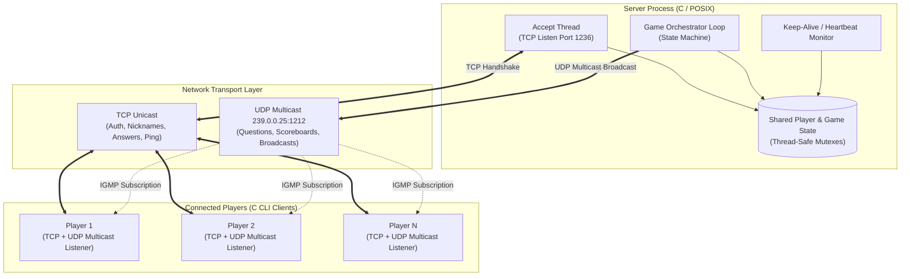

# Multiplayer Network Trivia Game in C (TCP + UDP Multicast)

[](https://en.wikipedia.org/wiki/C_(programming_language))
[](https://en.wikipedia.org/wiki/Berkeley_sockets)
[](https://en.wikipedia.org/wiki/Pthreads)
[](Makefile)
[](#network-and-system-architecture)

A multithreaded client-server Trivia Game built from scratch in C. The project implements a hybrid networking architecture combining **TCP** (for reliable control channels, client authentication, and answer verification) and **UDP Multicast** (for efficient, real-time broadcasts of game state, live questions, and dynamic scoreboards to all concurrent players).

---

## Technical Highlights and Features

- **Hybrid Network Architecture**:
  - **TCP Channel**: Reliable point-to-point communication for client registration, authentication handshake, ping/heartbeat keep-alive, and tamper-resistant answer submissions.
  - **UDP Multicast (IGMP)**: Low-latency, scalable datagram broadcasts (`239.0.0.25:1212`) for synchronizing game questions, match timers, announcements, and live scoreboards across all active players without redundant unicast overhead.
- **Multithreaded Server Engine**:
  - Independent POSIX threads (`pthread`) for non-blocking client connection accepting, background keep-alive/heartbeat monitoring, and the central game loop orchestrator.
  - Thread-safe synchronization using `pthread_mutex` primitives to eliminate race conditions when managing player pools and real-time scores.
- **Fault-Tolerant Session Management**:
  - Built-in Heartbeat / Ping-Ack mechanism (`PING_GAP` = 10s) with timeout detection to gracefully clean up disconnected or unresponsive clients without blocking the game flow.
  - Dynamic lobby and match lifecycle: players can join a lobby, flag ready status, and automatically transition into active game rounds.
- **Custom Wire Protocol and Serialization**:
  - Well-defined binary packet structures (`PktType` / `MsgKind`) ensuring strict type safety and payload alignment across the network layer.
- **Dynamic Question Engine**:
  - Delimited question bank parsing (`file.txt`) with runtime Fisher-Yates shuffle algorithm for randomized match questions.

---

## Network and System Architecture



---

## Custom Wire Protocol Specification

Communication between the Server and Clients utilizes fixed-size structured datagrams:

| Opcode / Kind | Description | Transport | Payload Structure |
| :--- | :--- | :--- | :--- |
| `PKT_MC_PARAM` | Transmits multicast IP and Port to newly joined clients | TCP Unicast | Text / Config Params |
| `PKT_MC_TEXT` | Global announcements (Lobby info, game countdowns, winner) | UDP Multicast | `TextMsg` (`msg[256]`) |
| `PKT_QUESTION` | Broadcasts trivia question, choice options, and round index | UDP Multicast | `QuizQuestion` (Question text, 4 choices) |
| `PKT_UC_TEXT` | Player answer submission or direct server feedback | TCP Unicast | `TextMsg` (`msg[256]`) |
| `PKT_SCOREBRD` | Synchronizes live player rankings and match standings | UDP Multicast | `ScorePkt` (Names, IDs, Scores array) |
| `PKT_PING` / `ACK` | Bi-directional keep-alive pulse & client responsiveness check | TCP Unicast | `PingAck` (`ok` flag) |
| `MSG_GAME_OVER` | Signals end of match and returns participants to lobby | UDP Multicast | Header Datagram |

---

## Project Structure

```text
.
├── Server.c        # Multithreaded TCP & UDP Multicast server implementation
├── Client.c        # Interactive CLI game client with multicast receiver
├── Makefile        # Compilation recipe with GCC optimization & POSIX thread flags
├── file.txt        # Configurable question bank dataset (semicolon-delimited)
├── Notes.txt       # Execution & setup notes
└── README.md       # Project documentation & architecture overview
```

---

## Getting Started

### Prerequisites
- **OS**: Linux, macOS, or Windows WSL (Windows Subsystem for Linux) / MSYS2 / POSIX-compatible environment with multicast support.
- **Compiler**: `gcc` (supporting C99 or newer).
- **Build Tool**: `make`.

### Compilation
Clone the repository and compile both the `Server` and `Client` binaries using the provided `Makefile`:

```bash
# Compile both Server and Client
make

# Or compile individually:
make Server
make Client

# Clean generated binaries
make clean
```

---

## Execution and Gameplay Flow

### 1. Launch the Server
Start the central quiz server in your first terminal:
```bash
./Server
```
*The server initializes on TCP port `1236`, binds to UDP Multicast group `239.0.0.25:1212`, and waits for players to connect.*

### 2. Connect Players
Open multiple separate terminal windows (simulating concurrent players) and launch a client in each:
```bash
./Client
```
- **Connection**: Enter the Server IP address (`127.0.0.1` for local testing) and your player nickname.
- **Lobby**: The client authenticates via TCP, joins the Multicast group, and enters the lobby.
- **Match Start**: Once at least **2 players** are connected and ready, the server initiates a 5-second countdown and begins the match.
- **Gameplay**: Answer questions before the round timer expires. Live scoreboards are updated after each question, and the match winner is announced at the end.

---

## Core Concepts and Skills Demonstrated

- **Low-Level Network Programming**: Berkeley Sockets API (`socket`, `bind`, `listen`, `accept`, `connect`, `setsockopt`).
- **Multicast Group Management**: Configuring IGMP group memberships with `IP_ADD_MEMBERSHIP` and multicast TTL settings.
- **Concurrent Programming**: POSIX Threads (`pthread_create`, `pthread_join`), mutex locks (`pthread_mutex_lock`), and race condition prevention.
- **Custom Protocol Design**: Struct packing, binary wire serialization, and multi-channel protocol synchronization.
- **Systems and Defensive Programming**: Signal handling, connection timeout management, memory safety, clean resource deallocation.

---

## License
This project is open-source and available under the [MIT License](LICENSE).
